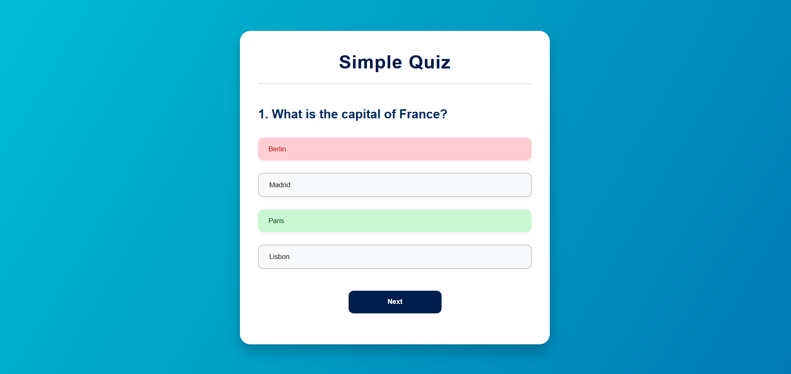

## 🎯 **Simple Quiz App**


A responsive, animated, and interactive quiz application built with HTML, CSS, and JavaScript. It displays multiple-choice questions, tracks user scores, and provides instant feedback with color-coded buttons for correct and incorrect answers.
## 📸 Demo



## 🧠 Features
Interactive multiple-choice questions

Real-time feedback on selected answers

Score calculation and display

Animated and visually appealing UI

Responsive design (works on all screen sizes)

Option to replay the quiz


## 🛠️ Technologies Used
HTML5 – For the basic structure

CSS3 – For beautiful and responsive styling

JavaScript (Vanilla) – For dynamic quiz logic and interactivity

## 🚀 **How to Run**

1. Clone this repository or download the ZIP file.
2. Extract the files and open `index.html` in any web browser.
3. Enjoy the quiz experience!

```bash
git clone https://github.com/yourusername/simple-quiz-app.git
cd simple-quiz-app
start index.html

